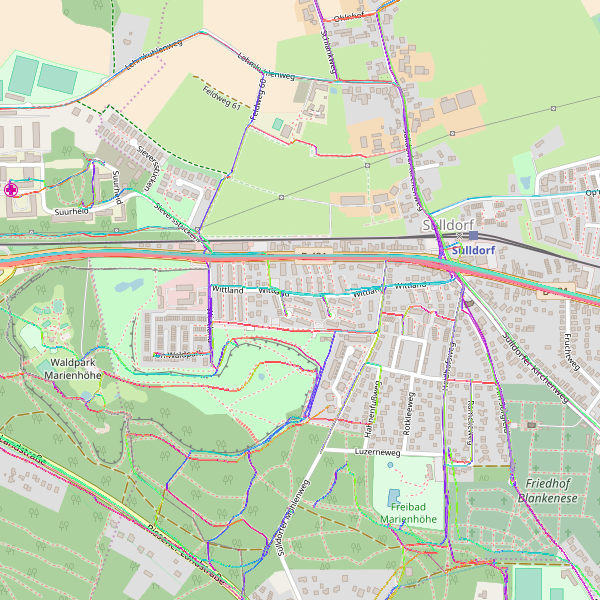

# Nkar image comparison and differences highlighting C++ API
Nkar (armenian: նկար) is an image processing and comparison utility. The comparison of two images of the same size based on comparing each pixel of one image with the corresponding pixel of another one. After all differences are identified, algorithm generates contours (polygons) that outlines the differences. The API provides both error reporting and differences analysis. For instance results contains information on the number of difference countours generated (see usage example below).

According to [stb single-file public domain libraries](https://github.com/nothings/stb) we use for image loading/decoding/saving the following image formats are supported: JPG, PNG, TGA, BMP, PSD, GIF, HDR, PIC.

[](https://travis-ci.org/vahancho/nkar)
[](https://ci.appveyor.com/project/vahancho/nkar/branch/master)
[](https://coveralls.io/github/vahancho/nkar)

### Installation

No installation required. Just copy and compile *color.h(.cpp), image.h(.cpp), point.h(.cpp) and comparator.h(.cpp)* from the src/ directory in your project and use `nkar::Comparator` class to compare two images.

### Prerequisites

There are no special requirements and dependencies except *C++11* compliant compiler. The class is tested with *gcc 4.8.4* and *MSVC 12.0* (Visual Studio 2013).
For more details see the CI badges (*Travis CI & AppVeyor CI*).

### Usage Example:

```cpp
// A simple application that compares two image files and saves differences in a third one.

#include <string>

#include "comparator.h"
#include "image.h"

using namespace nkar;

int main(int argc, char **argv)
{
  if (argc != 4) {
    fprintf(stderr, "Incorrect number of arguments\n");
    return -1;
  }

  // Compare two image files.
  auto result = Comparator::compare(argv[1], argv[2]);

  if (result.error() != Result::Error::NoError) {
    // An error occurred during comparison.
    fprintf(stderr, "%s\n", result.errorMessage().c_str());
    return -1;
  }

  if (result.status() == Result::Status::Different) {
    if (result.resultImage().save(argv[3])) {
      fprintf(stdout, "Images are different: %d contours found. Image with highlighting is saved to '%s'\n",
              result.contourCount(), argv[3]);
      return -1;
    } else {
      fprintf(stderr, "Failed to save result image\n");
      return -1;
    }
  }

  fprintf(stdout, "Images are identical\n");
  return 0;
}
```

### Test

There are unit tests provided for `nkar::Comparator` class. You can find them in the *test/* directory.
To run them you have to build and run the test application. For doing that you must invoke the following
commands from the terminal, assuming that compiler and environment are already configured:

##### Linux (gcc)
```
cd test
g++ -std=c++11 -I../src main.cpp -o test
./test `pwd`/images/
```

##### Windows
```
cd test
cl /W4 /I../srs /EHsc main.cpp /link /out:test.exe
test "%cd%"\images\
```

### Examples

Below are some examples of image comparison with results. Third image in each row represents an image generated by *Comparator* and contains contours (red outlines) that highlight the differences:

| expected | actual | diff with contours |
| --- | --- | --- |
|  |  |  |
|  |  |  |
|  |  |  |

### See Also

For reading and writing image files we used [stb single-file public domain libraries](https://github.com/nothings/stb)
